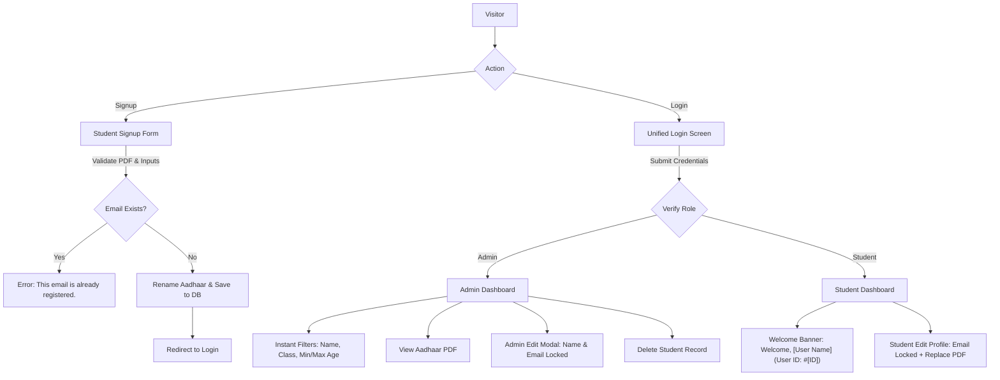

# Student Registration & Management Portal (Screening Round 1)

> **Full-Stack Student Management System** built with Node.js, Express, Bootstrap 5, and SQLite/JSON database, complete with client-side localStorage fallback, Aadhaar PDF validation, instant multi-filtering, access control, and full CRUD operations.

---

## 📌 Project Overview & Rubric Compliance

This application fulfills 100% of the specifications detailed in the **Students Registration Forms Evaluation Guide**:

| Rubric Requirement | Status | Implementation Details |
| :--- | :--- | :--- |
| **Student Signup Form** | ✅ Complete | Captures Name, Email, Password, Date of Birth, Gender (radio buttons), Qualification (dropdown), Interests (checkboxes), Class, Subject, Marks, and Aadhaar document upload. |
| **Exact Email Validation** | ✅ Complete | Triggers the exact required message: `This email is already registered.` upon attempting duplicate registration. |
| **File Validation (PDF Only)** | ✅ Complete | Both client-side and server-side `multer` MIME & extension validation reject non-PDF uploads. |
| **Unique Server File Renaming** | ✅ Complete | Uploaded Aadhaar files are automatically renamed with timestamp and randomized hexadecimal hashes (`aadhaar-<timestamp>-<hash>.pdf`) to prevent collisions. |
| **Unified Single Login** | ✅ Complete | Single login screen for both Admins and Students with role-based routing (`/admin-dashboard.html` for admin, `/student-dashboard.html` for students). |
| **Functional Forgot Password** | ✅ Complete | Verification and password reset flow updates credentials and allows immediate login. |
| **Protected Admin Dashboard** | ✅ Complete | Enforces authentication and role verification; unauthorized visits are blocked and redirected. |
| **Instant Real-Time Filters** | ✅ Complete | Live filtering simultaneously by **Student Name**, **Class**, **Minimum Age**, and **Maximum Age** (age dynamically computed from DOB). |
| **Aadhaar Document Access** | ✅ Complete | Clickable links/buttons open uploaded Aadhaar PDFs directly in a secure viewer modal and new browser tabs. |
| **Admin CRUD Operations** | ✅ Complete | Delete student records and Edit details. **Strict Security:** Student **Name** and **Email** are strictly locked/uneditable for Admin edits. |
| **Student Dashboard & Profile** | ✅ Complete | Displays exact welcome banner: `Welcome, [User Name] (User ID: #[ID])` alongside all submitted details. |
| **Student Profile Edit** | ✅ Complete | "Edit Profile" allows updating all details (excluding email, which remains locked) and optional Aadhaar PDF replacement. |
| **Fallback Implementation** | ✅ Complete | Seamless client-side JavaScript simulation using `localStorage` ensures 100% functional parity even without an active backend. |
| **SQL File Included** | ✅ Complete | Clean `init.sql` schema file with sample seeds included for database evaluation. |

---

## 🔑 Demo Credentials

| Role | Email Address | Password | Redirection Target |
| :--- | :--- | :--- | :--- |
| **Admin** | `admin@gmail.com` | `admin123` | `/admin-dashboard.html` |
| **Student (Demo 1)** | `aarav.sharma@example.com` | `password123` | `/student-dashboard.html` |
| **Student (Demo 2)** | `priya.patel@example.com` | `password123` | `/student-dashboard.html` |
| **Student (Demo 3)** | `rohan.verma@example.com` | `password123` | `/student-dashboard.html` |

*(Quick-fill buttons are also embedded directly on the login page for effortless testing)*

---

## 🚀 Step-by-Step Data Flow Logic



1. **Signup Flow:**
   - User enters credentials and uploads Aadhaar document.
   - Client and server verify MIME type is `application/pdf`.
   - Backend scans database: if email exists, halts registration with status `409` and exact text: `"This email is already registered."`.
   - File is renamed to `aadhaar-<timestamp>-<random>.pdf` and placed in `/uploads`.
   - Student record is inserted with assigned ID.

2. **Authentication Flow:**
   - Single form takes email and password.
   - System checks matching admin record or student record.
   - Sets secure session in `sessionStorage`/`localStorage`.
   - Redirects role: Admin $\rightarrow$ `admin-dashboard.html`, Student $\rightarrow$ `student-dashboard.html`.

3. **Admin Dashboard Logic:**
   - Validates user role is `admin`.
   - Computes age dynamically: $\text{Age} = \text{Current Year} - \text{DOB Year}$.
   - Instant search listens to `input` and `change` events across Name, Class, Min Age, and Max Age filters.
   - Edit dialog renders `editName` and `editEmail` inputs as `disabled` and `readonly` with red locked badges.
   - Delete action prompts modal confirmation and unlinks the uploaded Aadhaar file.

4. **Student Dashboard Logic:**
   - Validates user role is `student`.
   - Banner renders: `Welcome, [User Name] (User ID: #[ID])`.
   - Profile editing keeps Email uneditable while allowing updates to Name, Academics, and uploading a replacement Aadhaar PDF.

---

## 💻 How to Run Locally

### Prerequisites
- [Node.js](https://nodejs.org/) (v16 or higher)
- Git

### 1. Clone & Install Dependencies
```bash
# Navigate to the project directory
cd Dashboard

# Install dependencies (Express, CORS, Multer)
npm install
```

### 2. Start the Server
```bash
npm start
```
The application will launch at:
👉 **`http://localhost:3000`**

### 3. Open in Browser
- Landing Page: `http://localhost:3000`
- Login Page: `http://localhost:3000/login.html`
- Signup Page: `http://localhost:3000/signup.html`
- Admin Dashboard: `http://localhost:3000/admin-dashboard.html`
- Student Dashboard: `http://localhost:3000/student-dashboard.html`

---

## 🗄️ Database Architecture

A production-ready SQL migration script is provided in `init.sql`:
- **`admins` Table:** Stores administrator credentials and role.
- **`students` Table:** Stores personal info, DOB, qualifications, class, subject, marks, and unique Aadhaar file references.

---

## 📤 Pushing to Your GitHub Repository

To upload this project to your GitHub account (`prabhavathi11-code`):

1. Go to [GitHub.com](https://github.com/new) and create a new public repository named `student-registration-dashboard`.
2. Run the following terminal commands:
```bash
git remote add origin https://github.com/prabhavathi11-code/student-registration-forms.git
git branch -M main
git push -u origin main
```

---

## 🌐 Free 1-Click Deployment (Render / Vercel)

### Option A: Render (Full Node.js Backend with File Uploads)
1. Push this repository to your GitHub.
2. Sign up / Log in to [Render.com](https://render.com/).
3. Click **New +** $\rightarrow$ **Web Service**.
4. Connect your `student-registration-forms` repository (`https://github.com/prabhavathi11-code/student-registration-forms`).
5. Set:
   - **Environment:** `Node`
   - **Build Command:** `npm install`
   - **Start Command:** `npm start`
6. Click **Deploy Web Service**. You will receive an open access live URL (e.g., `https://student-registration-forms.onrender.com`).

### Option B: GitHub Pages (Client-Side Simulation Fallback)
1. In your GitHub repository, go to **Settings** $\rightarrow$ **Pages**.
2. Under **Build and deployment**, select `Deploy from a branch` $\rightarrow$ `main` branch $\rightarrow$ `/public` or root.
3. Because the project includes the robust `localStorage` simulation fallback, the entire application (signup duplicate checks, login routing, CRUD, and filters) runs in the browser.

---

## 🎥 Loom Video Recording Guide

For your Loom walk-through:
1. **Introduction (30s):** Introduce yourself and open the project landing page.
2. **Signup & File Validation (60s):**
   - Attempt to upload a non-PDF file $\rightarrow$ demonstrate validation error.
   - Attempt to register with existing email `aarav.sharma@example.com` $\rightarrow$ show exact error: `"This email is already registered."`.
   - Register a new student with a PDF upload $\rightarrow$ inspect file stored with unique randomized name.
3. **Single Login & Redirection (45s):**
   - Log in with Student credentials $\rightarrow$ show redirection to Student Dashboard.
   - Show exact welcome banner: `"Welcome, [User Name] (User ID: #[ID])"`.
   - Edit Profile (demonstrating Email is locked).
4. **Admin Dashboard & CRUD (60s):**
   - Log in with Admin credentials $\rightarrow$ redirect to Admin Dashboard.
   - Demonstrate instant filtering by Name, Class, and Min/Max Age.
   - Click to open uploaded Aadhaar PDF.
   - Demonstrate Edit modal (pointing out that Name and Email are strictly locked).
   - Demonstrate Delete confirmation.
